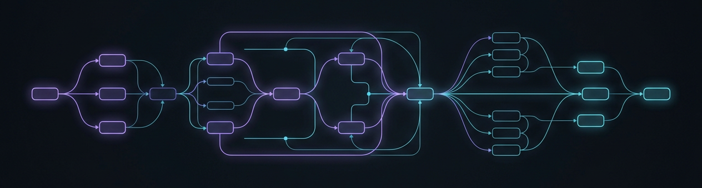

<!-- ============================================================
     GitHub Profile — ikeke6
     Less resume, more personality.
     AI × Engineering.
     ============================================================ -->

<!-- Header banner (local asset) -->

  

<!-- Typing SVG -->

<!-- Badges -->

  
  
  
  <!-- TODO: enable after WakaTime is configured
  
  -->

<!-- Contribution Snake (auto-generated by .github/workflows/snake.yml) -->

  <picture>
    <source media="(prefers-color-scheme: dark)" srcset="profile-snake-contrib/github-contribution-grid-snake-dark.svg" />
    <source media="(prefers-color-scheme: light)" srcset="profile-snake-contrib/github-contribution-grid-snake.svg" />
    
  </picture>

---

### About

- 🎓 Master's student in Computer Science
- 💻 Full-Stack Developer — Java / Spring ecosystem
- 🤖 Building AI applications with LLM, RAG, MCP and Multi-Agent Systems
- ⚙️ Care about clean architecture, performance and shipping reliable systems
- 📚 First-author publication in 3D Vision

**`Build it. Ship it.`**

---

### Tech Stack

**Backend & Engineering**

  
  
  
  
  
  
  
  
  

**AI Engineering**

  
  
  
  
  
  
  
  
  

---

### GitHub Stats

  <picture>
    <source media="(prefers-color-scheme: dark)" srcset="https://github-readme-stats.vercel.app/api?username=ikeke6&show_icons=true&hide_border=true&theme=github_dark&hide_rank=false" />
    <source media="(prefers-color-scheme: light)" srcset="https://github-readme-stats.vercel.app/api?username=ikeke6&show_icons=true&hide_border=true&theme=default" />
    
  </picture>
  <picture>
    <source media="(prefers-color-scheme: dark)" srcset="https://streak-stats.demolab.com?user=ikeke6&hide_border=true&theme=github-dark-blue" />
    <source media="(prefers-color-scheme: light)" srcset="https://streak-stats.demolab.com?user=ikeke6&hide_border=true&theme=default" />
    
  </picture>

  <picture>
    <source media="(prefers-color-scheme: dark)" srcset="https://github-readme-stats.vercel.app/api/top-langs/?username=ikeke6&layout=compact&hide_border=true&theme=github_dark" />
    <source media="(prefers-color-scheme: light)" srcset="https://github-readme-stats.vercel.app/api/top-langs/?username=ikeke6&layout=compact&hide_border=true&theme=default" />
    
  </picture>

  <picture>
    <source media="(prefers-color-scheme: dark)" srcset="https://github-readme-activity-graph.vercel.app/graph?username=ikeke6&hide_border=true&theme=github-dark&area=true" />
    <source media="(prefers-color-scheme: light)" srcset="https://github-readme-activity-graph.vercel.app/graph?username=ikeke6&hide_border=true&theme=github&area=true" />
    
  </picture>

---

### Metrics

<!-- Auto-generated by .github/workflows/metrics.yml -->

  
  

---

### Coding Time

<!-- Powered by WakaTime — workflow kept as waka.yml.bak, disabled for now -->
<!-- TODO: Replace with your own WakaTime Share Chart if you want a visual chart -->

<!--START_SECTION:waka-->
<!--END_SECTION:waka-->

---

  Build it. Ship it.

<!-- TODO: Add personal website -->
<!-- TODO: Add public email -->
